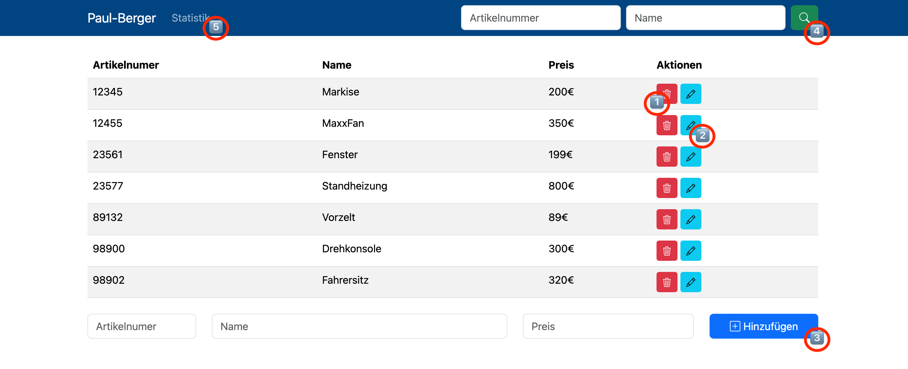
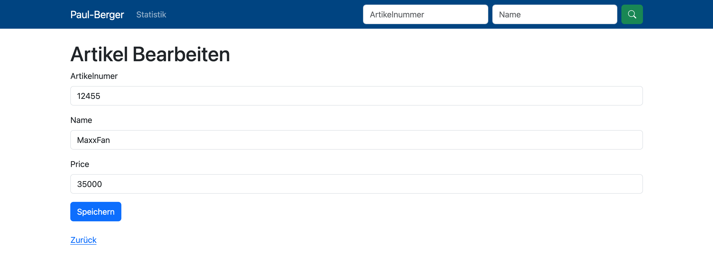

# PAUL-Berger

PAUL-Berger ist eine Anwendung zur Verwaltung von Lagerbeständen.


## Benutzer­dokumentation

### Benutzeroberfläche und Funktionen



#### Hauptansicht
- **Löschen:** Über das rote Mülleimer-Symbol können Artikel entfernt werden. 1️⃣
- **Bearbeiten:** Mit dem blauen Stift-Symbol lassen sich Artikel bearbeiten. 2️⃣

#### Artikel hinzufügen
Tragen Sie unten die Artikelnummer, den Namen sowie den Preis ein und klicken Sie anschließend auf den blauen Button, um einen neuen Artikel anzulegen. 3️⃣


#### Suche
Nutzen Sie das Suchfeld oben rechts, um gezielt nach Artikelnummer, Name oder beidem zu suchen. Starten Sie die Suche mit einem Klick auf die grüne Lupe. 4️⃣


#### Artikel bearbeiten
- Ändern Sie den Namen im entsprechenden Feld.
- Passen Sie den Preis im Preisfeld an.
- Speichern Sie die Änderungen über den blauen Button.



#### Statistik
Die Statistik gruppiert die Artikel anhand der ersten beiden Ziffern der Artikelnummer. 5️⃣


## IT-Dokumentation

Für produktive Umgebungen empfiehlt sich der Einsatz etablierter Frameworks wie Symfony oder Laravel sowie eines ORMs wie Doctrine. Diese bieten Vorteile hinsichtlich Sicherheit, Performance und einer sauberen Implementierung von Dependency Injection. In diesem Projekt wurde bewusst auf solche Frameworks verzichtet, um die eigene Herangehensweise und Programmierweise transparent darzustellen.

Es bestehen zahlreiche Möglichkeiten zur Weiterentwicklung der Anwendung, beispielsweise:
- Erweiterte Testabdeckung
- Integrationstests
- Implementierung von Benutzerverwaltung und Authentifizierung
- Paginierung der Tabellenansicht
- Indexierung der Datenbank
- Preisberechnung und Speicherung in Cents
- Verbesserte Dependency Injection
- Automatisiertes Deployment
- Verwendung korrekter HTTP-Methoden für CRUD-Operationen
- Implementierung von REST-Endpunkten und AJAX-Requests im Frontend
- Optimierung von UX/UI
- Statische Codeanalyse und automatisierte Tests (CI)
- Automatische Befüllung der Datenbank mit Testdaten nach Docker-Initialisierung

Eine Umsetzung all dieser Punkte würde jedoch den zeitlichen Rahmen dieses Projekts sprengen.

## Installation

```bash
git clone https://github.com/paulbellmann/paul-berger.git
cd paul-berger
cp sample.env .env
docker compose up -d
```

Anschließend in den Container wechseln und ein Verzeichnis zurückgehen, um die Abhängigkeiten zu installieren:

```bash
docker compose exec webserver bash
cd /var/www/
./setup.sh
```

Die Anwendung ist anschließend unter [http://localhost](http://localhost) erreichbar. PHPMyAdmin steht unter [http://localhost:8080](http://localhost:8080) zur Verfügung.

Der Quellcode der Anwendung liegt im Verzeichnis `app`, der Framework-Code unter `src`.

### Tests ausführen

```bash
docker compose exec webserver bash
cd /var/www/
composer test
```

### Code-Style automatisch korrigieren

```bash
docker compose exec webserver bash
cd /var/www/
composer fix
```